# RTIC website using wowchemy
Made using wowchemy, deployed using github and netlify. No-code alternative to website building.

- [How to add a new person profile](##how-to-add-a-new-person-profile)
- [How to add a new project page (unfinished)](##how-to-add-a-new-project-page)

Find this website on https://rtic-ucl.netlify.app

This version of an RTIC test website uses the same software as the [POND](https://ucl-pond.github.io) and [MANIFOLD LAB](https://manifold-lab.netlify.app) groups at UCL.

To edit this "research group" template, explore the "contents" folder, as all the files in this folder are contents that show in the corresponding page of the website. The preview looks like a table, and when the edit button is clicked, the file looks like markdown (simple text file). Change any text or image links directly on the document (remember to upload image to "assets/media/" first).

An exception to this are the personal profiles, which are edited in the "authors" folder in github, but that show up in the "people" page of the website.

For further information, visit the wowchemy documentation: https://wowchemy.com/docs/

-----------------------------------------------------------------------------
## How to add a new person profile

1. Go to rtic-ucl/wowchemy-rtic-website/content/authors
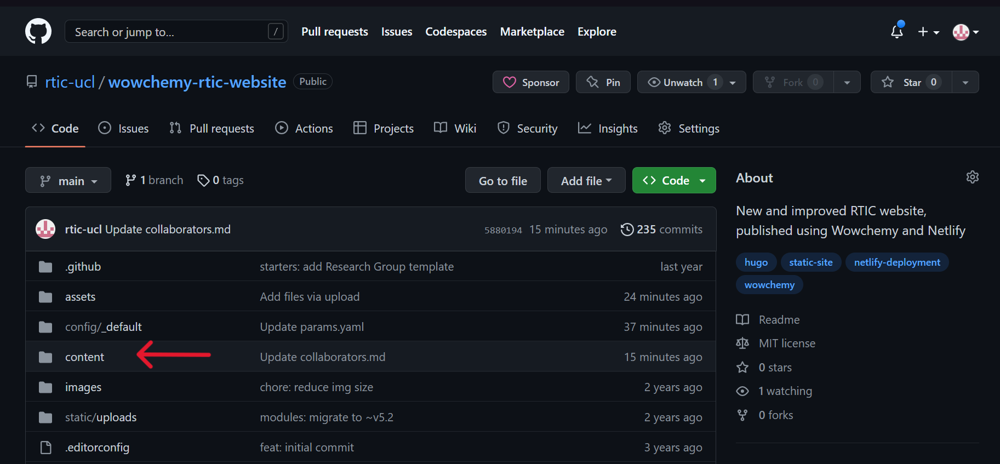
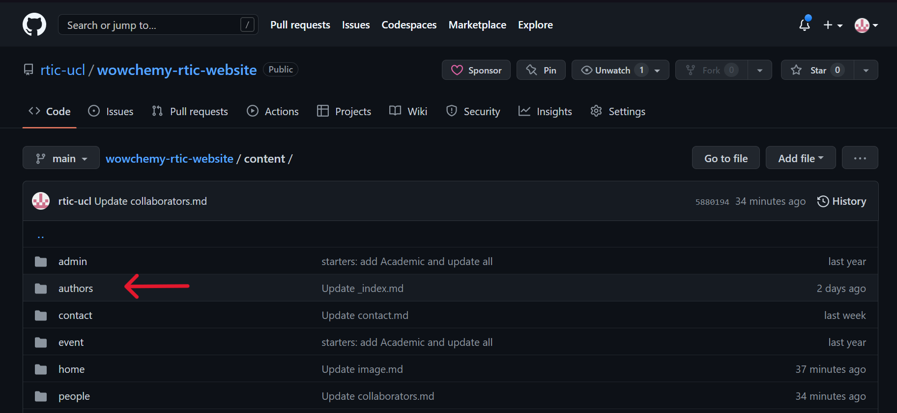
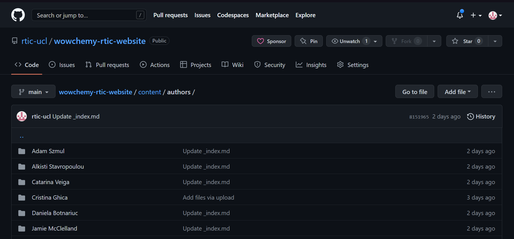
This is the authors folder, where information of group members is stored. It is then displayed to the website via the people widget (../content/people/people.md).

2. Create a new file, and call it "<person's name>/_index.md". In this example, "Firstname Lastname/_index.md". The slash (/) will automatically create a folder called <person's name> with a file called "_index.md" in that folder.
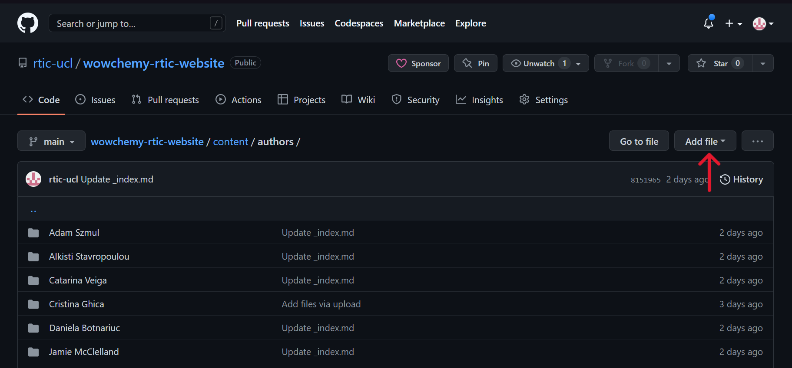
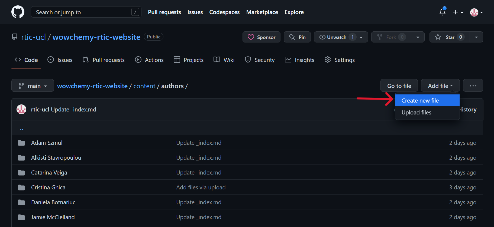
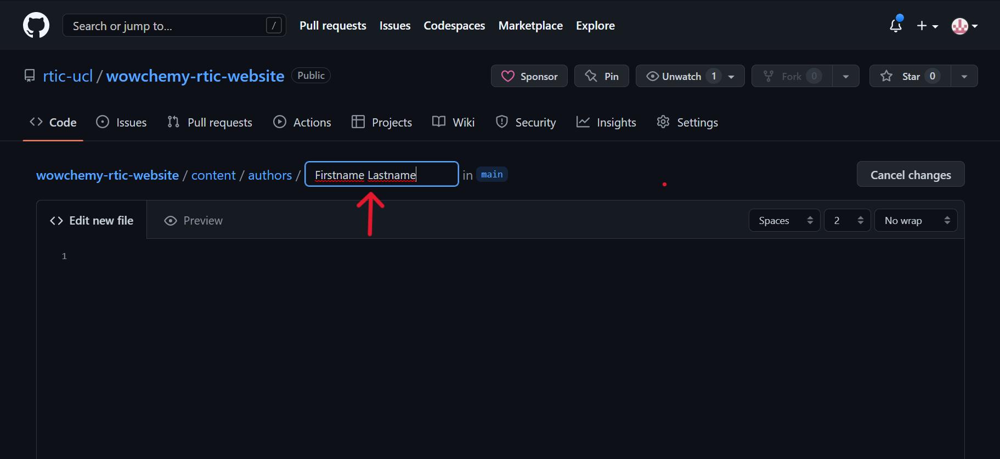
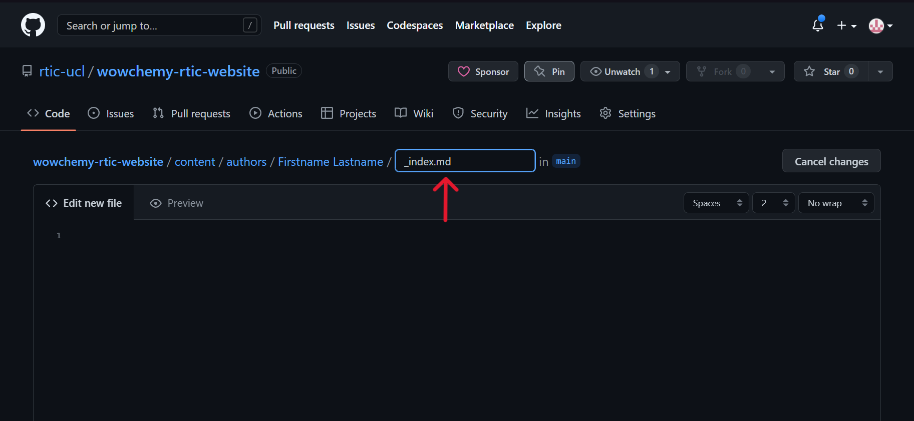

3. Then, copy the "_index.md" file from a different person's folder to use as a template. 
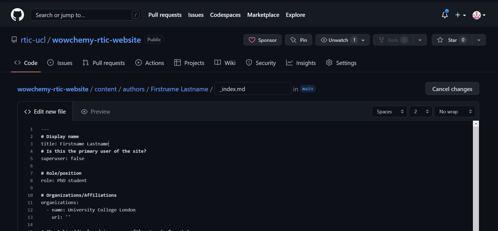

4. Replace the name in the "title: " field to the display name for the person you want to make a profile for. *Display name* means that this is the name that actually appears on the website, although this is usually the same as the folder name. Pronouns can be added here as well (just type them after the name).

5. The 'superuser' sets the main/primary user of the site. If set to "true", then that user would have a small profile/bio appear below any blog articles/projects where they are set to author. For now, all people are set to "superuser: false".

6. The "role: " field is the displayed role which will appear below the person's name in their profile. This can be set to anything, even multiple roles or positions separated by commas. (e.g. "role: Principal Investigator, Supervisor, Co-lead")

7. The "organisations" list the different organisations that a person is part of. This will be useful for visitors and collaborators. Note that a link to the organisation's website must be provided in the "url: " field, but currently this is set to an empty field for all users because we have not yet made sure that this website adheres to UCL branding policies.

8. Next, the "bio: " field is a few sentences which should appear at the end of blog posts/project pages where the person is set as author. This is optional, since the bio functions seems not to work in this website (I think it only shows a bio for the person set as "superuser"; currently nobody).
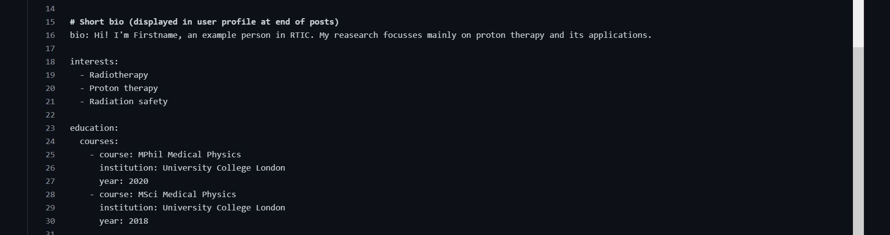

9. The "interests: " field is a list of interests which shows up below the person's name, social icons, and role. Simply list a few of the person's research interests, there is no restriction for this field. 

10. The "education: " field optionally lists some of the person's courses. In the "courses: - course: " field, add the course title and optionally the title of the thesis/dissertation as applicable. In the "courses:   institution: " field, add the name of the university that awarded the degree (or universities if the degree was jointly awarded). In the "couses:   year: " field, add the year of graduation/completion of that degree.

To add another degree, copy and paste the "- course/institution:/year:" bulletpoint such that the alignment is the same in both, and replace with the other course's information. (Note that for all existing author profiles, I added the most recent degrees at the top of the list.)

11. For social and academic networking, replace the link with the link to that person's corresponding social media or academic profile. If a type of profile (e.g. twitter) is not used, comment it out by adding hashtags (# ) at the start of each line, or alternatively delete that whole "- icon:/ icon_pack:/ link:" bulletpoint.
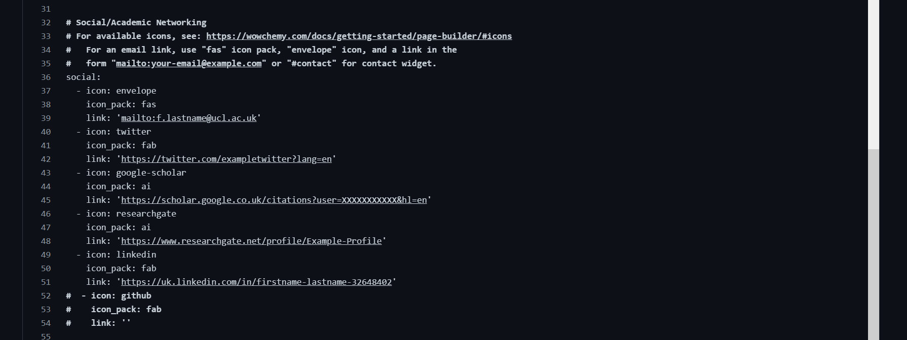
This contents will appear as clickable icons below that person's name and role, which will open the corresponding link in a new tab.

To see which social media/academic icons are already available within the Wowchemy icon packs, and for more information about this widget, visit this link: https://wowchemy.com/docs/getting-started/page-builder/#icons.

12. Optionally, it is possible to add a CV to your profile. To do this, uncomment the three "- icon:/  icon_pack:/  link:" lines by removing the hashtags (# ). Later, upload a copy of the person's CV under "static/files/cv.pdf". Note that this has not yet been tested for any existing people profiles.
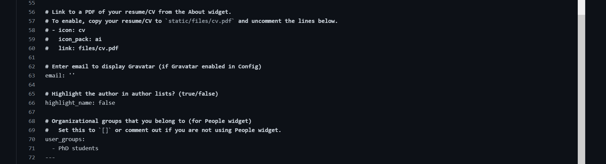

13. Gravatar is not enabled in "config", so leave the Gravatar "email: " field blank, or delete those two lines (62 and 63 in the image).

14. Set "highlight_name: " to "true" if you want this author to be highlighted in author lists in blog posts or project pages. Note that no other profile currently have this feature enabled.

15. The "user_groups: " field determines which title (or titles) this person will appear under in the people widget. If a person belongs to multiple user gorups, they will appear twice - once under each title coresponding to their user groups. To see the existing user groups in the "People" page of the website, go to "../content/people/people.md".

16. Finally, anything under the three dashes (---) will appear in that person's personal page. Add as little or as much information as you like: for example, a biography, fun facts about that person, or details about theur research. This section is written in markdown, so titles, bold text, and italic text can be added if desired. (see https://wowchemy.com/docs/content/writing-markdown-latex/)
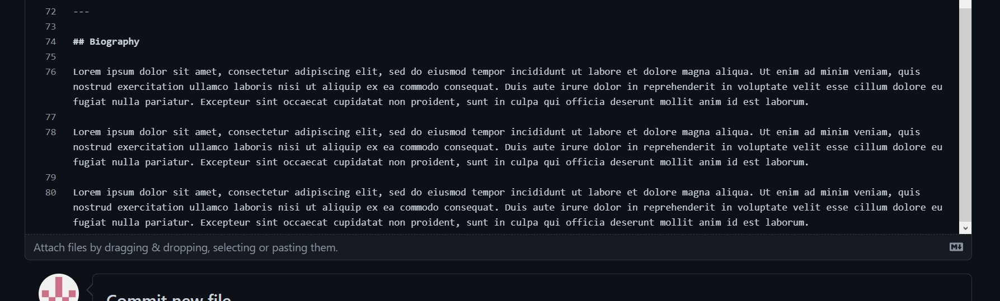

17. To publish this author profile, scroll down to "Commit new file" and click the green "Commit new file" button. At this point, the person's profile is published and should appear on the website within a few minues.
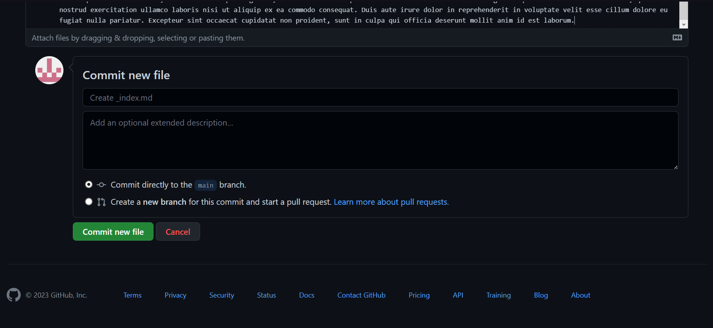

#### Adding a profile picture

18. To add a profile picture, open the person's author folder, e.g. "../content/authors/Firstname Lastname/". Click "Add File" and then "Upload Files". You should be taken to a new page that says "Drag files here to add them to your repository".
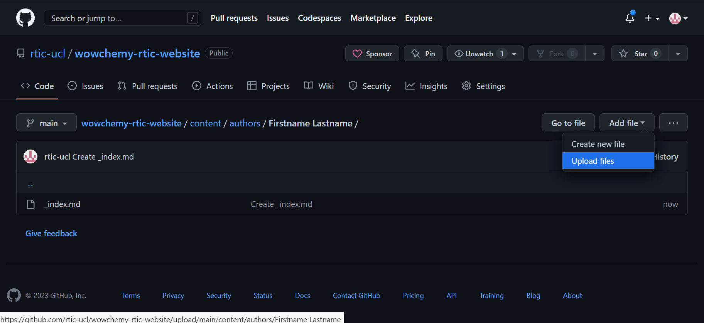
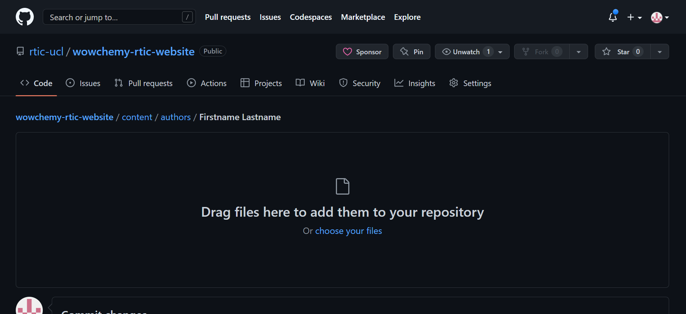

19. Find the person's profile picture in your files, or download it to your computer if you haven't already. Rename the file to "avatar.jpg" or "avatar.png" depending on the file type.

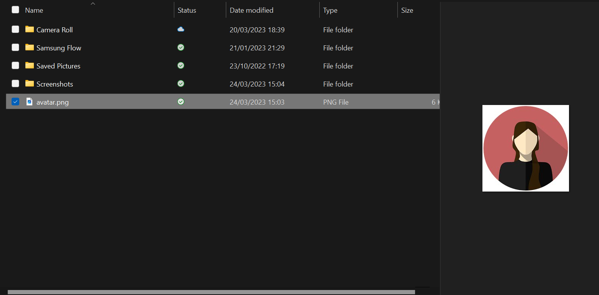

20. Either drag the avatar file to the github upload page or click on the words "choose your file" in blue and choose the avatar file from your computer's files.
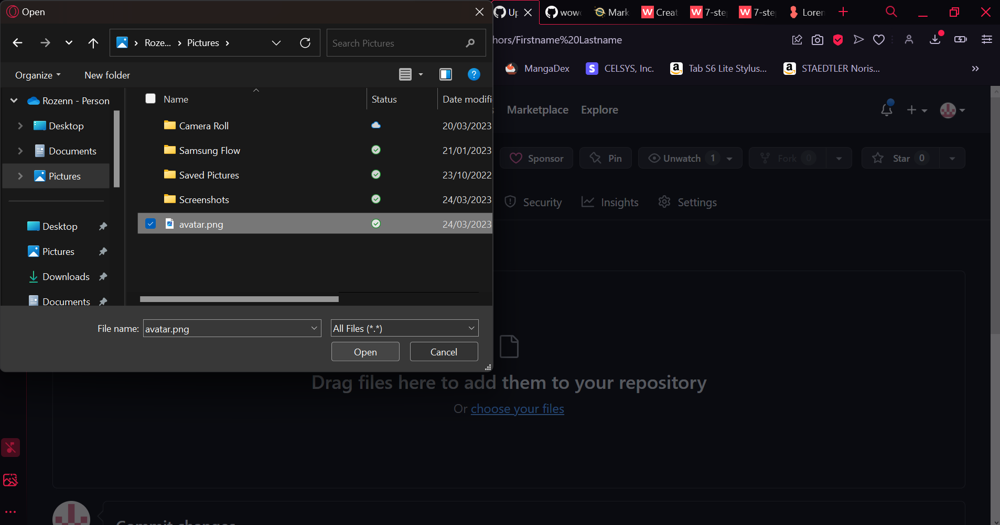

21. Scroll down and click "Commit changes" (green button). The picture should be uploaded to that person's author folder under the name "avatar.png" or "avatar.jpg". It should appear on the person's profile in the website within a few minutes.
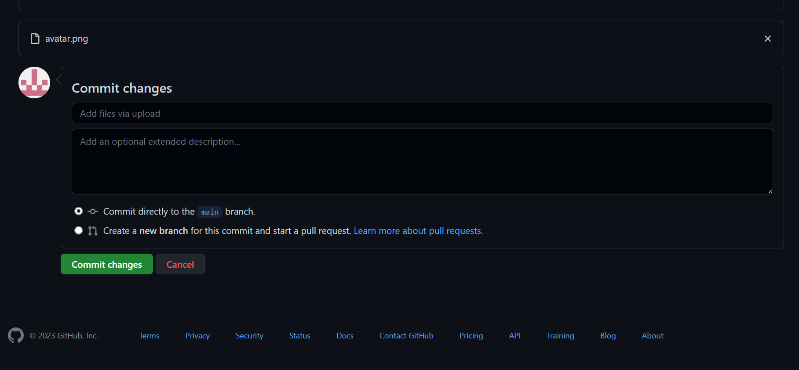

-----------------------------------------------------------------------------

## How to add a new project page

...

-----------------------------------------------------------------------------

## [Hugo Research Group Theme](https://github.com/wowchemy/starter-hugo-research-group)

The **Research Group Template** empowers your research group to easily create a beautiful website with a stunning homepage, news, academic publications, events, team profiles, and a contact form.

️**Trusted by 250,000+ researchers, educators, and students.** Highly customizable via the integrated **no-code, widget-based Wowchemy page builder**, making every site truly personalized ⭐⭐⭐⭐⭐

  

Easily write technical content with plain text Markdown, LaTeX math, diagrams, RMarkdown, or Jupyter, and import publications from BibTeX.

[Check out the latest demo](https://research-group.netlify.app/) of what you'll get in less than 60 seconds, or [view the showcase](https://wowchemy.com/creators/).

The integrated [**Wowchemy**](https://wowchemy.com) website builder and CMS makes it easy to create a beautiful website for free. Edit your site in the CMS (or your favorite editor), generate it with [Hugo](https://github.com/gohugoio/hugo), and deploy with GitHub or Netlify. Customize anything on your site with widgets, light/dark themes, and language packs.

- 👉 [**Get Started**](https://wowchemy.com/hugo-themes/)
- 📚 [View the **documentation**](https://wowchemy.com/docs/)
- 💬 [Chat with the **Wowchemy research community**](https://discord.gg/z8wNYzb) or [**Hugo community**](https://discourse.gohugo.io)
- ⬇️ **Automatically import citations from BibTeX** with the [Hugo Academic CLI](https://github.com/wowchemy/hugo-academic-cli)
- 🐦 Share your new site with the community: [@wowchemy](https://twitter.com/wowchemy) [@GeorgeCushen](https://twitter.com/GeorgeCushen) [#MadeWithWowchemy](https://twitter.com/search?q=%23MadeWithWowchemy&src=typed_query)
- 🗳 [Take the survey and help us improve #OpenSource](https://forms.gle/NioD9VhUg7PNmdCAA)
- 🚀 [Contribute improvements](https://github.com/wowchemy/wowchemy-hugo-themes/blob/main/CONTRIBUTING.md) or [suggest improvements](https://github.com/wowchemy/wowchemy-hugo-themes/issues)
- ⬆️ **Updating?** View the [Update Guide](https://wowchemy.com/docs/hugo-tutorials/update/) and [Release Notes](https://github.com/wowchemy/wowchemy-hugo-themes/releases)

## We ask you, humbly, to support this open source movement

Today we ask you to defend the open source independence of the Wowchemy website builder and themes 🐧

We're an open source movement that depends on your support to stay online and thriving, but 99.9% of our creators don't give; they simply look the other way.

### [❤️ Click here to become a GitHub Sponsor, unlocking awesome perks such as _exclusive academic templates and widgets_](https://github.com/sponsors/gcushen)

## Demo credits

Please replace the demo images with your own.

- [Female scientist](https://unsplash.com/photos/uVnRa6mOLOM)
- [2 Coders](https://unsplash.com/photos/kwzWjTnDPLk)
- [Cafe](https://unsplash.com/photos/RnDGGnMEOao)
- Blog posts
  - https://unsplash.com/photos/AndE50aaHn4
  - https://unsplash.com/photos/OYzbqk2y26c
- Avatars
  - https://unsplash.com/photos/5yENNRbbat4
  - https://unsplash.com/photos/WNoLnJo7tS8
